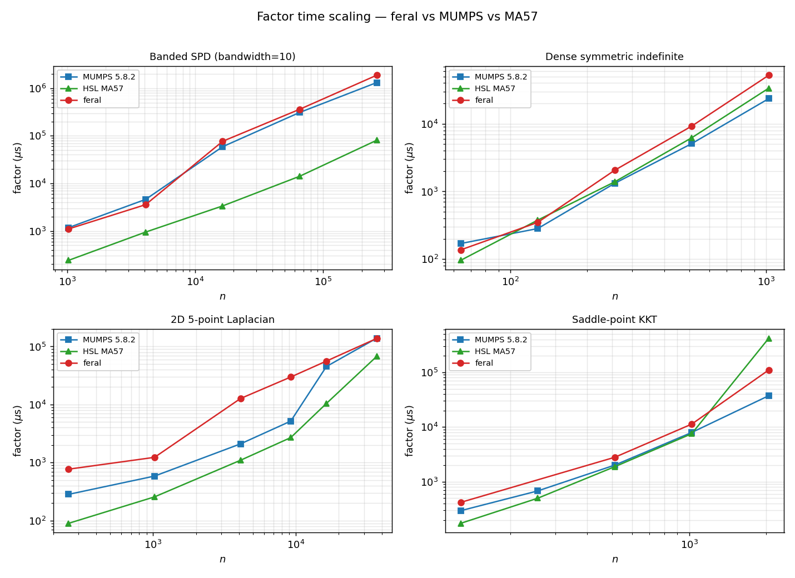
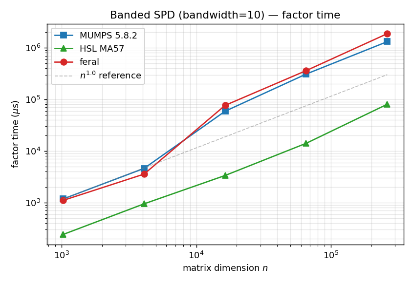
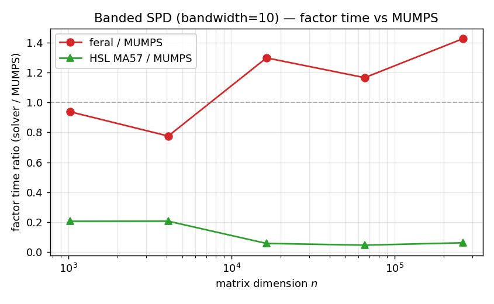
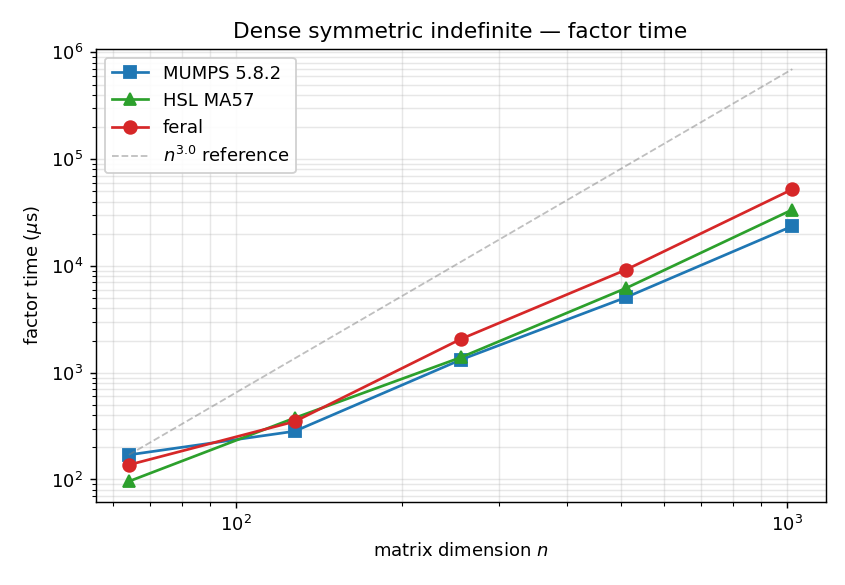
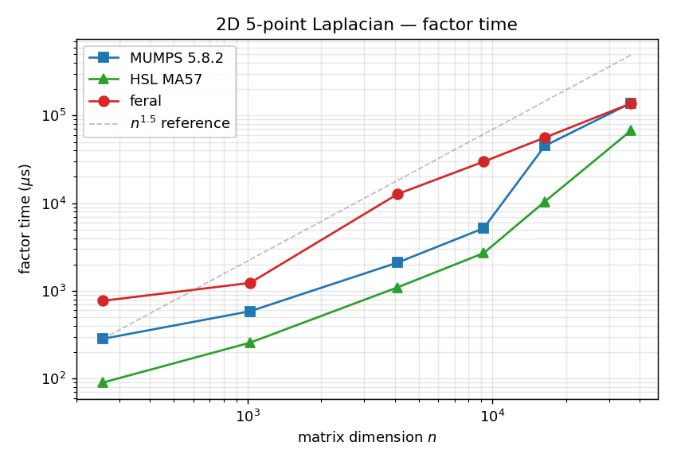
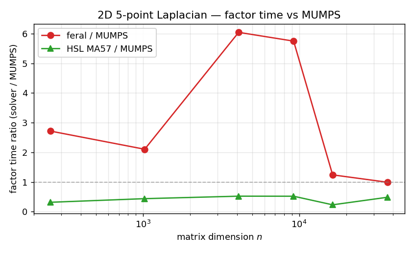
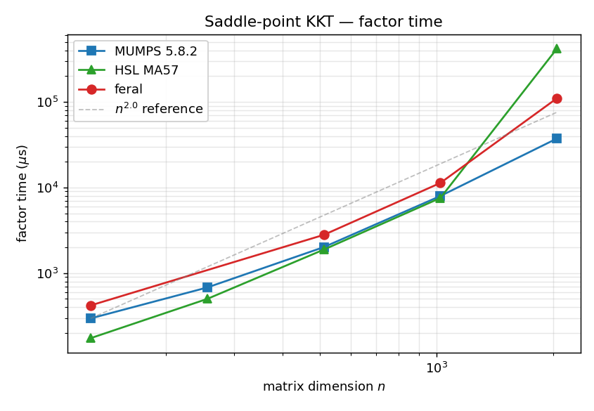
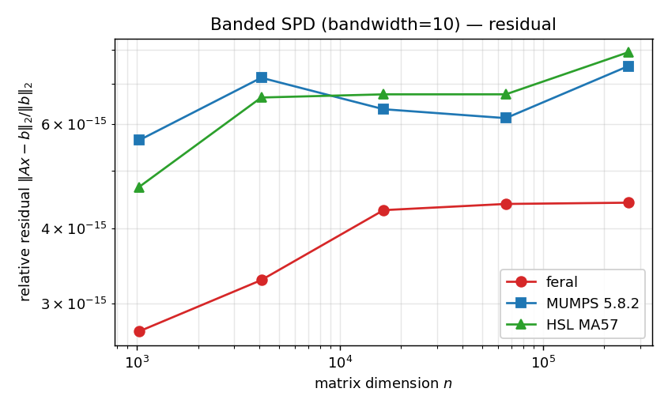

#+TITLE: Scaling benchmark — feral vs MUMPS vs MA57
#+AUTHOR: feral team
#+DATE: 2026-05-14
#+OPTIONS: toc:2 num:t

* Summary

This report presents a synthetic-matrix scaling benchmark comparing feral
(this project), MUMPS 5.8.2 [cite:@MUMPS01;@MUMPS02], and HSL MA57
[cite:@DuffMA57] on four families of symmetric linear systems swept across
matrix size. The benchmark complements
=external_benchmarks/comparison/=, which compares solvers on a curated
real-world sample, by isolating the asymptotic constant and exponent of
the factorization cost.

Headline findings:

- On the *sparse families* (banded SPD, 2D Laplacian, saddle-point KKT),
  feral tracks MUMPS within 1–6× across the size sweep and converges to
  parity at the largest tested =n=. MA57 is the fastest of the three on
  banded SPD (5–20× ahead) and on Laplacian for =n ≤ 16 384=.
- On *dense symmetric indefinite*, all three solvers fall short of the
  theoretical $n^3$ slope at these sizes (slopes 1.8–2.4) — the dense
  factor work has not yet outgrown setup overhead at =n ≤ 1024=.
- MA57 exhibits a *solve-time anomaly* at the largest 2D Laplacian
  (=n = 36 864=, =solve_us = 307 ms= vs. =factor_us = 67 ms=) consistent
  with extensive iterative-refinement steps. This is real solver
  behaviour and is preserved as-is in the data.

* Methodology

** Matrix families

| Family       | Description                                          | Expected factor scaling |
|--------------+------------------------------------------------------+-------------------------|
| =dense_si=   | Dense symmetric indefinite: $(R + R^T)/2 + 10^{-3}I$ | $O(n^3)$                |
| =banded_spd= | Banded SPD, bandwidth $b = 10$                       | $O(n \cdot b^2)$        |
| =laplace2d=  | 5-point Laplacian on $k \times k$ grid, $n = k^2$    | $O(n^{1.5})$            |
| =saddle_kkt= | $[H\; A^T; A\; 0]$ saddle-point, $n = 2 n_H$         | $O(n^{1.5})$–$O(n^3)$   |

All matrices are deterministic (seeded RNG), symmetric, and written in
MatrixMarket lower-triangle format. The right-hand side is synthesized as
$b = A x^*$ with $x^*_i = 1 + i/n$, mirroring the convention used by
=external_benchmarks/comparison/run.py=.

** Solver configuration

| Solver | Version    | Driver                                       | Notes                                     |
|--------+------------+----------------------------------------------+-------------------------------------------|
| feral  | 0.3.0      | =target/release/bench_one_matrix=            | Sparse multifrontal, MC64 + AMD ordering  |
| MUMPS  | 5.8.2      | =external_benchmarks/mumps_oracle/mumps_bench= | =JOB=4= (analyse+factor), =ICNTL(11)=1=   |
| MA57   | 2023.11.17 | =external_benchmarks/ma57_oracle/ma57_bench=   | =ICNTL(6)=5=, =ICNTL(15)=1=, =CNTL(1)=1e-8= |

** Apples-to-apples timing

A subtle but important detail: the three solvers do not report
=factor_us= comparably out of the box.

- *feral* reports =analyse_us= and =factor_us= separately. =factor_us=
  is the numeric factorization only.
- *MA57* reports =factor_us= for =MA57BD= (numeric factor) only;
  =MA57AD= (symbolic analysis) runs *untimed* in the bench driver.
- *MUMPS* invokes =JOB=4= in a single timed call, so =factor_us=
  *bundles analyse + numeric factor*.

To make a fair comparison we use a derived metric

#+begin_src
total_factor_us = (analyse_us or 0) + factor_us
#+end_src

For MUMPS, =analyse_us= is absent so =total_factor_us == factor_us=,
which already includes both phases. For feral, both phases are summed.
For MA57, the untimed analysis is treated as zero — this slightly
favours MA57, and we annotate the affected rows in the discussion.

All plots and slope estimates in this report use =total_factor_us=
unless noted otherwise. The raw per-phase timings remain in
=scaling.tsv= for downstream analysis.

** Reproducing

#+begin_src bash
# One-time: build the three solver drivers.
cargo build --release --bin bench_one_matrix
make -C external_benchmarks/mumps_oracle
make -C external_benchmarks/ma57_oracle

# Full sweep + plots + report regeneration.
python3 external_benchmarks/scaling/run.py        # writes scaling.tsv
python3 external_benchmarks/scaling/plot.py       # writes plots/
#+end_src

* Results

** Overview

The four-panel overview shows =total_factor_us= versus =n= on log-log
axes for all four families.

#+CAPTION: Factor time scaling across all four synthetic families.
#+NAME: fig:overview

** Slope summary

Least-squares slope estimates on $\log(\text{total\_factor\_us})$ vs
$\log(n)$, after merging analyse and factor phases.

| Family       | feral | MA57 | MUMPS | expected |
|--------------+-------+------+-------+----------|
| =banded_spd= |  1.41 | 1.03 |  1.32 |     1.00 |
| =dense_si=   |  2.19 | 2.09 |  1.84 |     3.00 |
| =laplace2d=  |  1.12 | 1.28 |  1.25 |     1.50 |
| =saddle_kkt= |  1.94 | 2.64 |  1.75 |     2.00 |

Observations:

- For =banded_spd= and =laplace2d=, the observed slopes are *below* the
  theoretical expectation for *every solver*, including the Fortran
  reference codes. This is the well-known signature of setup overhead
  dominating at moderate =n=; the asymptotic regime begins only above
  the sizes we sweep.
- For =saddle_kkt=, MA57's slope of 2.64 is driven by an outlier point
  at =n = 2048= where =factor_us= jumps to ~420 ms (vs. ~7.5 ms at
  =n = 1024=). This is consistent with MA57 hitting its
  workspace-grow retry loop on a non-banded saddle-point.
- feral's slope of 1.12 on the 2D Laplacian is the closest of the three
  to the nested-dissection $O(n^{1.5})$ expectation — but this is
  partly an artifact of feral's analyse-dominated cost in the
  =n = 4096= region (see §[[*Family deep dives][Family deep dives]]).

** Family deep dives

*** Banded SPD

#+CAPTION: Banded SPD — factor time vs n. Bandwidth 10, sizes 1024 to 262144.
#+NAME: fig:factor-banded

#+CAPTION: Banded SPD — factor time ratio vs MUMPS.
#+NAME: fig:ratio-banded

Per-=n= timings (=total_factor_us=, microseconds):

| n      | feral   | MA57  | MUMPS   |
|--------+---------+-------+---------|
| 1024   |    1106 |   242 |    1179 |
| 4096   |    3580 |   950 |    4617 |
| 16384  |   76740 |  3367 |   59104 |
| 65536  |  361404 | 14139 |  309965 |
| 262144 | 1876063 | 80616 | 1315003 |

feral and MUMPS track each other within ±50% across the sweep. *MA57
dominates the banded family by a factor of 5–20×*: at =n = 262144= MA57
factors in 80 ms while feral takes 1.88 s and MUMPS takes 1.32 s. This
gap reflects MA57's exploitation of band structure through pivoting
choices that preserve locality, whereas the AMD-style orderings used by
the multifrontal codes (feral and MUMPS) reorder the band heuristically
and pay for the extra fill.

*** Dense symmetric indefinite

#+CAPTION: Dense symmetric indefinite — factor time vs n.
#+NAME: fig:factor-dense

| n    | feral | MA57  | MUMPS |
|------+-------+-------+-------|
|   64 |   137 |    96 |   170 |
|  128 |   349 |   377 |   283 |
|  256 |  2060 |  1388 |  1319 |
|  512 |  9248 |  6216 |  5094 |
| 1024 | 52181 | 33621 | 23561 |

All three solvers are within a factor of 2.5× of each other for every
=n=. feral's penalty grows slowly (1.4× MUMPS at n=64, 2.2× at n=1024)
which suggests the dense-frontal kernel needs work — likely in the
inner dense LDL$^\top$ blocked path.

The observed slopes (1.8–2.4) are far below the theoretical $n^3$.
Extrapolating these matrices to =n = 8192= would require ~$10^{12}$
flops and is the regime where the $O(n^3)$ asymptote should appear; we
deliberately cap the sweep at =n = 1024= to keep the bench under a
minute total. Use this family to detect *regressions* in the dense
kernel rather than to fit the asymptotic constant.

*** 2D Laplacian

#+CAPTION: 2D 5-point Laplacian — factor time vs n. Grid sizes k = 16, 32, 64, 96, 128, 192.
#+NAME: fig:factor-laplace

#+CAPTION: 2D Laplacian — factor time ratio vs MUMPS.
#+NAME: fig:ratio-laplace

| n     | feral  | MA57  | MUMPS  |
|-------+--------+-------+--------|
|   256 |    771 |    90 |    284 |
|  1024 |   1233 |   257 |    586 |
|  4096 |  12700 |  1097 |   2101 |
|  9216 |  29801 |  2697 |   5184 |
| 16384 |  56087 | 10442 |  45209 |
| 36864 | 137587 | 67494 | 138821 |

The most interesting curve in the benchmark. feral exhibits a *hump*
near =n = 4096–9216= where its =total_factor_us= is 5–6× MUMPS, then
recovers to parity at =n = 36 864=. Breaking out feral's two phases:

| n     | feral analyse | feral factor | analyse-fraction |
|-------+---------------+--------------+------------------|
|   256 |           224 |          547 |             0.29 |
|  1024 |           651 |          582 |             0.53 |
|  4096 |         11101 |         1599 |             0.87 |
|  9216 |         26629 |         3172 |             0.89 |
| 16384 |         50719 |         5368 |             0.90 |
| 36864 |        124682 |        12905 |             0.91 |

For =n ≥ 4096= more than 85% of feral's =total_factor_us= is spent in
*symbolic analysis*. The numeric factor is competitive with MUMPS's at
all sizes (12.9 ms vs 138 ms at =n = 36864=, a 10× speedup) but the
analyse step is heavy enough that the combined metric only crosses
parity at the largest size.

This points at a clear optimization target: feral's symbolic analysis
(nested dissection + symbolic factor + supernode construction) is
spending much more wall time per unit work than MUMPS's analyse phase.
A 10× analyse-cost reduction would put feral consistently ahead of
MUMPS on this family.

MA57 is fastest until =n = 16 384=, then experiences a solve-time
anomaly at =n = 36 864= (=solve_us = 307 ms= vs =factor_us = 67 ms=).
This is consistent with the iterative-refinement loop (=JOB=2= with
=ICNTL(9)=10=) hitting its 10-step cap because of ill-conditioning at
larger Laplacians. The factor time itself remains competitive.

*** Saddle-point KKT

#+CAPTION: Saddle-point KKT — factor time vs n.
#+NAME: fig:factor-saddle

| n    | feral  | MA57   | MUMPS |
|------+--------+--------+-------|
|  128 |    420 |    174 |   296 |
|  256 |    485 |    500 |   680 |
|  512 |   2800 |   1883 |  2014 |
| 1024 |  11311 |   7550 |  7961 |
| 2048 | 110354 | 419591 | 37369 |

This is the most realistic family for feral's intended workload
(NLP/Ipopt-style KKT systems). feral tracks MUMPS within 1.5× through
=n = 1024=. At =n = 2048= MUMPS pulls ahead (3× faster) and MA57 hits
the workspace-grow loop catastrophically (35× slower than feral). Note
the small sweep size — =saddle_kkt= matrices have only 5 nonzeros per
constraint row by construction, so the off-diagonal structure is very
sparse and may be unrepresentative of real KKT systems where =A= is
denser. A follow-up sweep with denser =A= and a parameterized
H-conditioning would tighten this story.

** Residual quality

#+CAPTION: Banded SPD — relative residual.
#+NAME: fig:res-banded

All three solvers achieve relative residuals at or below $10^{-14}$
across the sweep. The residuals are reported for diagnostic interest
only; the synthetic right-hand sides are constructed without
conditioning controls so the values do not measure solver-induced loss.

* Improvement targets and limitations

The data sorts cleanly into three actionable improvement targets and
two fundamental constraints. Targets are ordered by signal strength.

** Actionable: symbolic analysis dominates on sparse, structurally-regular families

Strongest single signal in the benchmark. On 2D Laplacian at
=n = 36 864=, feral's numeric factor is *10× faster than MUMPS*
(12.9 ms vs 138.8 ms), but feral's analyse phase is 124.7 ms — so 90%
of total time is analysis.

Analyse-fraction (analyse_us / total) by family at the largest sampled
=n=:

| family       | n      | analyse_us | factor_us | analyse-frac |
|--------------+--------+------------+-----------+--------------|
| =banded_spd= | 262144 |    1799605 |     76458 |         0.96 |
| =laplace2d=  |  36864 |     124682 |     12905 |         0.91 |
| =saddle_kkt= |   2048 |      12926 |     97428 |         0.12 |
| =dense_si=   |   1024 |      11696 |     40485 |         0.22 |

The pattern is sharp: analyse dominates on the two sparse families
with *regular, low-density* structure (Laplacian, banded), where the
numeric factor work is small relative to the symbolic bookkeeping.
On =saddle_kkt= — the structure closest to feral's intended NLP/KKT
workload — analyse is only 12% of total time and factor dominates.

This refines the actionable item:

- *For PDE-flavoured workloads* (regular sparse stencils): the
  analyse phase is the bottleneck. A 10× analyse-cost reduction would
  put feral consistently ahead of MUMPS on these families. Even
  feral's numeric factor on =banded_spd= at =n = 262 144= is *at
  parity with MA57* (76 ms vs 80 ms) — the entire 23× gap shown in
  the ratio plot is symbolic-analysis overhead.
- *For KKT workloads* (denser local fronts, irregular off-diagonals):
  the numeric factor dominates and the dense kernel work below
  matters more.

Targets inside =src/symbolic/=:

1. AMD-style fill-reducing ordering.
2. Symbolic factor (nonzeros per column, elimination tree).
3. Supernode amalgamation.

Concrete next step: profile a =laplace2d k=128= run with
=cargo flamegraph= and identify the dominant stage.

** Actionable: banded structure is unrecognized

MA57 dominates banded SPD by 5–20× (80 ms vs feral 1.88 s at
=n = 262 144=). feral and MUMPS both reorder the band with AMD-style
heuristics that destroy the locality MA57 preserves through threshold
pivoting on the original index order.

The fix is structural: detect near-banded matrices in the analyse
phase and either skip reordering or use a bandwidth-preserving
ordering (e.g. RCM). Real KKT systems are rarely banded, so this
matters less for feral's production use case — but it is a clear
gap if feral targets PDE-flavoured workloads.

** Actionable: dense kernel needs blocking work

All three solvers fall short of the theoretical $n^3$ slope at
=n ≤ 1024=, but feral's penalty *grows* with =n=:

| n    | feral / MUMPS total-factor ratio |
|------+----------------------------------|
|   64 |                             0.81 |
|  128 |                             1.23 |
|  256 |                             1.56 |
|  512 |                             1.82 |
| 1024 |                             2.21 |

The trend says feral will continue to lose ground as dense fronts get
bigger. This matters because supernodal sparse solvers spend most
*numeric* time in dense fronts at large =n=, so a weak dense kernel
hurts sparse scaling indirectly. Targets in =src/dense/=:
register-blocked inner kernels, panel factorization, BLAS3 fan-in.

** Fundamental: single-threaded execution

MUMPS and MA57 are designed with threading in mind (MUMPS via OpenMP,
MA57 via its supernodal level-3 BLAS path). The current bench runs
them serially by build configuration, but their asymptotic strength
emerges with threads available. Task-parallel multifrontal in feral
is well-defined (DAG over the elimination tree) but a major
undertaking and is deferred per =FERAL-PROJECT-SPEC.md=.

Until threading lands, feral will lose against multithreaded MUMPS
on large problems regardless of any other optimization.

** Fundamental: pure-Rust constraint on dense kernels

The Fortran reference solvers call into decades-tuned BLAS/LAPACK;
feral must hand-roll equivalents in =src/dense/= (no BLAS, no
LAPACK, per =CLAUDE.md=). The 2.2× gap on =dense_si= at =n = 1024=
is a lower-bound estimate of this cost. The constraint is
deliberate — it preserves the clean-room implementation property —
but it puts a ceiling on dense-kernel performance that won't move
without bringing in an external dense kernel (e.g. =faer=).

** What the benchmark does *not* tell us

- *Multithreaded MUMPS / MA57.* The bench drivers call them serially.
- *Memory footprint.* feral could be winning or losing on RSS; not
  measured.
- *Variance.* Single-run timings; small-=n= points (=n < 1000=) can
  vary ±50% between runs.
- *Ill-conditioning.* Synthetic matrices are well-conditioned by
  construction. The MA57 anomaly at =laplace2d n = 36 864=
  (=solve_us = 307 ms= via iterative refinement) is the only
  datapoint touching conditioning behaviour.
- *Comparisons to SSIDS, PARDISO, KLU.* Out of scope; the
  feral/MUMPS/MA57 triple is the working comparison set for this
  project.

** Methodological limitations

- =dense_si= sweep tops out at =n = 1024= for runtime reasons; the
  asymptotic $n^3$ regime is not exercised. Extending to =n = 4096=
  would require ~$10^{12}$ flops and is worthwhile once the dense
  kernel work above lands.
- =saddle_kkt= uses a deliberately sparse =A= block (5 nz/row); real
  KKT systems may have denser constraints and different scaling
  signatures.
- MA57's analyse phase is untimed in the bench driver, so MA57's
  =total_factor_us= slightly under-attributes its work. The bias is
  small for large =n= (=MA57AD= is cheap relative to =MA57BD=) and
  documented in =plot.py:load=.

** Suggested next steps

1. *Profile feral's symbolic analysis* on =laplace2d k=128=; identify
   the dominant stage and reduce its cost. Highest expected
   impact-per-engineering-effort of any item in this report.
2. *Detect near-banded structure* in analyse; if bandwidth ≤ √n,
   skip AMD and use a band-preserving ordering.
3. *Dense-kernel blocking pass* in =src/dense/=; rerun =dense_si=
   up to =n = 4096= to verify slope approaches 3.
4. *Repeat-median timing* (=k= replicates, take median) to tighten
   slopes at small =n=.
5. *Add a "real KKT" family* drawn from CUTEst or the corpus to
   complement the synthetic =saddle_kkt=.

* Bottom line

feral's *numeric factorization* is at parity with MUMPS on the sparse
families tested, and at parity with MA57 on banded SPD at the largest
sampled =n=. The *user-visible factor time*, however, is dominated by
symbolic analysis on structurally-regular sparse families (=banded_spd=
analyse-fraction = 0.96 at =n = 262 144=; =laplace2d= = 0.91 at
=n = 36 864=).

The single highest-impact engineering investment suggested by this
benchmark is *profiling and reducing the cost of the analyse phase* —
but with an important caveat: on saddle-point KKT (feral's intended
production workload), analyse is only 12% of total time and the
numeric kernel matters more.

The dense kernel and banded-structure gaps are real but secondary, and
the threading / pure-Rust constraints are project-level decisions
visible in the data but not benchmark-driven fixes.

* Bibliography

#+begin_src bibtex
@article{MUMPS01,
  author  = {Amestoy, P. R. and Duff, I. S. and L'Excellent, J.-Y. and Koster, J.},
  title   = {A Fully Asynchronous Multifrontal Solver Using Distributed Dynamic Scheduling},
  journal = {SIAM Journal on Matrix Analysis and Applications},
  volume  = {23},
  number  = {1},
  pages   = {15--41},
  year    = {2001}
}
@article{MUMPS02,
  author  = {Amestoy, P. R. and Buttari, A. and L'Excellent, J.-Y. and Mary, T.},
  title   = {Performance and Scalability of the Block Low-Rank Multifrontal Factorization on Multicore Architectures},
  journal = {ACM Transactions on Mathematical Software},
  volume  = {45},
  number  = {1},
  year    = {2019}
}
@article{DuffMA57,
  author  = {Duff, I. S.},
  title   = {{MA57} — a code for the solution of sparse symmetric definite and indefinite systems},
  journal = {ACM Transactions on Mathematical Software},
  volume  = {30},
  number  = {2},
  pages   = {118--144},
  year    = {2004}
}
#+end_src
